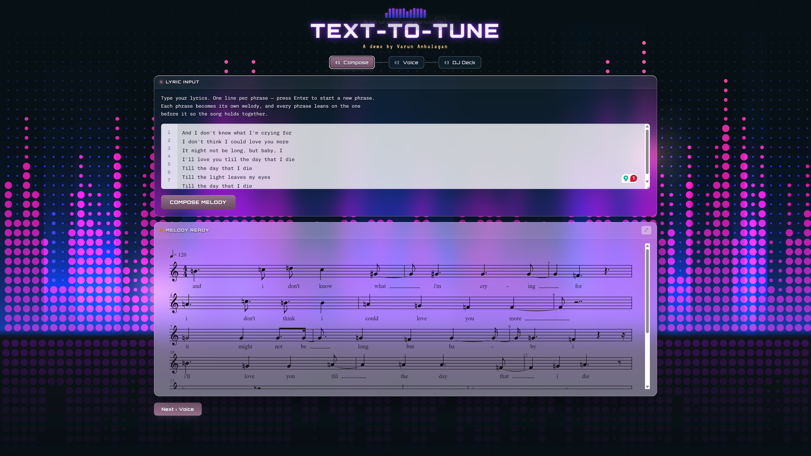

# Text-to-Tune
Instrumental Composition from Lyrics with LSTM-GAN

  

## Input Lyrics from Vocals - 
https://github.com/user-attachments/assets/fb3d0a17-b1f2-43c9-b783-bb09b8ebceb4

## Model Output Visualization

## MIDI Output, wav converted to mp4 for github compatability - 
https://github.com/user-attachments/assets/43095709-e519-4dec-93d5-b6184e6b1a2d

## Final Composition, output mixed with vocals - 
https://github.com/user-attachments/assets/af9d5e34-6d9c-4815-bec7-d01794524bf6

 
 

---  

       
 

### Requirements
python 2.7 and cuda 8.0.  
gensim  
pretty_midi  
py_midi  
tensorflow-gpu 1.14.0  
jupyter  
matplotlib  
scikit-learn  

### Folders
 - *Data*: a folder containing the raw file-by-file dataset to be preprocessed (songs_word_level) and a folder which stores the matrix-shaped dataset after pre-processing
 - *enc_models*: a folder containing the word2Vec and syllable2Vec model trained on our lyrics dataset
 - *saved_gan_models*: folder in which are stored the trained models for TexttoTune. 
 - *settings*: folder containing the settings files to be given as arguments for the training.

#### Python files
- *lstm-gan-main*: Main model. To run (requires CUDA >= 8.0 and matching tensorflow-gpu version): python lstm-gan-lyrics2melody.py --settings_file settings
-*0.ipynb*: create the dataset matrices using the raw data present in ./data/songs_word_level.
-*3.ipynb*: generate triplets of music attributes for lyrics in the testing set.
-*4.ipynb*: generate a midi file for a given lyrics.
- Others: utilities function and MIDI processing tools
